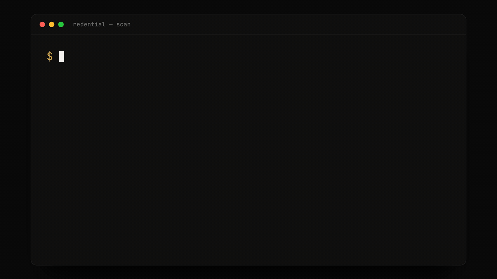

<h1 align="center">Redential CLI</h1>

<div align="center">

[English](../../README.md) · [Español](README.es.md) · [Português (BR)](README.pt-BR.md) · [Français](README.fr.md) · **Italiano**

<p></p>

<p></p>

<p><picture>
<source media="(prefers-color-scheme: dark)" srcset="../assets/tagline-dark.svg?v=2">

</picture></p>

[](https://www.npmjs.com/package/@redential/cli)
[](https://github.com/Redential/redential-cli/actions/workflows/ci.yml)
[](../../LICENSE)

Il tuo lavoro migliore è probabilmente coperto da un NDA.

Trasforma il lavoro privato in una credenziale per sviluppatori NDA-safe. Il
tuo codice non lascia mai la tua macchina.



[Sito web](https://redential.com) · [Modello di fiducia](#modello-di-fiducia) · [FAQ](#faq) · [Documentazione](#documentazione)

</div>

## Come funziona

```bash
npx redential scan
```

Nessun login, nessuna configurazione, nessuna installazione globale. `scan`
viene eseguito interamente in locale e non effettua alcuna chiamata di rete.

Redential CLI analizza la cronologia git e i pattern di implementazione in
locale, quindi produce un bundle (pacchetto di metadati) limitato che
descrive le competenze e le capacità rilevate nei repository che non puoi
connettere.

Esamini il bundle esatto prima che venga caricato qualsiasi cosa. Se scegli
di inviarlo (submit), Redential aggiunge quella prova a un [**profilo di
capacità Attested (attestato)**](faq.it.md#cosa-dimostra-realmente-attested) che puoi
condividere.

Il tuo codice sorgente non lascia mai la tua macchina.

<!-- TODO: Add screenshot of a public profile showing Attested private-work capabilities -->

## Eseguilo

Quando vuoi il risultato sul tuo profilo Redential:

```bash
npx redential login    # device flow, one time
npx redential submit   # scans again, shows you the bundle, asks before uploading
npx redential logout   # deletes the locally stored session
```

Preferisci un'installazione persistente:

```bash
npm install -g redential
redential scan
```

(`redential` è un alias di
[`@redential/cli`](https://www.npmjs.com/package/@redential/cli), il
pacchetto canonico: vedi [Verificare il pacchetto stesso](#verificare-il-pacchetto-stesso).)

Piattaforme supportate: macOS, Linux e Windows, su Node.js 20 e 22: ogni
release viene verificata su tutte e sei le combinazioni dalla CI.

## Cosa mostra `scan`

Su un terminale reale, `scan` stampa un breve riepilogo leggibile da un
essere umano, non il JSON grezzo. È costruito interamente a partire da campi
già presenti nel bundle (vedi [../schema.md](../schema.md) per ogni campo, e
[../scan.md](../scan.md) per il layout completo): le capacità rilevate (i
risultati strutturali, come un flusso di gestione webhook verificato,
vengono mostrati per primi; tutto il resto è raggruppato per categoria), i
principali linguaggi e categorie, i rapporti di ownership e di commit
firmati, e un blocco finale che ribadisce cosa lascia la macchina e cosa non
lo fa mai:

```
  PRIVATE WORK, LOCALLY DERIVED
  1 year · 1,378 authored commits · 78% ownership

  CAPABILITIES DETECTED

  Payment webhook flow     4 commits   STRUCTURAL · DIRECT

  Payments
    Stripe                12 commits

  TOP LANGUAGES
  .ts   ████████████████████   62%
  .sql  █████░░░░░░░░░░░░░░░   14%

  TOP CATEGORIES
  Backend  ████████████████████   51%
  Testing  ███████░░░░░░░░░░░░░   18%

  Ownership       78% of this repo's commits are yours
  Signed commits  45% of your commits are cryptographically signed

  ────────────────────────────────────────────────────────────
  Nothing left your machine. Nothing is uploaded unless you run
  `redential submit` — and only the bounded bundle: aggregates,
  salted fingerprints, and closed-vocabulary capability slugs.
  Never code, file names, commit messages, or other contributors.
  Verify: github.com/Redential/redential-cli
  ────────────────────────────────────────────────────────────

  Inspect the exact payload:  redential scan --json
  More detail (hour/weekday histograms):  redential scan --details

  Add this private work to your public Redential profile:
  → redential login && redential submit
```

Il JSON esatto è a un flag di distanza, mai nascosto: `redential scan --json`
(oppure `redential scan | jq`, o qualsiasi stdout reindirizzato/in pipe)
stampa **solo** il bundle letterale, byte per byte quello che `submit`
invierebbe: e `redential submit` mostra sempre quello stesso identico JSON
per intero, immediatamente prima di chiederti di confermare il caricamento,
su ogni percorso, in modo non saltabile. Il riepilogo sopra è una comodità
valida solo per il terminale, derivata da quello stesso bundle, mai una
seconda fonte di dati.

Questa è la forma del payload (`redential scan --json`): ciò che viene
effettivamente esaminato prima di qualsiasi caricamento:

```
{
  "schema_version": "1.2.0",
  "runner": "local",
  "tool_version": "0.5.0",
  "created_at": "2026-07-09T14:32:01.000Z",
  "repo": { "host_type": "github", "age_days": 742, "repo_fingerprint": "a3f9…" },
  "identity": { "author_identity_hashes": ["9c1e…"], "other_contributors_count": 3 },
  "commits": { "user_total": 1847, "first_at": "2024-06-02T09:14:00Z", "last_at": "2026-07-08T21:05:00Z", "span_days": 767, "hour_histogram": [...], "weekday_histogram": [...] },
  "signed": { "count": 831, "ratio": 0.45, "key_types": ["ssh"] },
  "languages": [ { "extension": ".ts", "share": 0.62 }, { "extension": ".sql", "share": 0.14 } ],
  "categories": [ { "name": "backend", "commit_count": 902, "churn_share": 0.51 }, { "name": "testing", "commit_count": 340, "churn_share": 0.18 } ],
  "detected_skills": [ { "slug": "payments/stripe", "commit_count": 12, "first_seen": "2024-09-01T10:00:00Z", "last_seen": "2025-11-20T18:30:00Z" }, { "slug": "payments/payment-webhook-flow", "commit_count": 4, "first_seen": "2024-09-03T08:00:00Z", "last_seen": "2024-09-03T08:00:00Z", "evidence": "structural", "confidence": "direct" } ],
  "ownership": { "user_commit_ratio": 0.78 },
  "integrity": { "merkle_root": "7be2…", "algorithm": "sha256", "date_forensics": { "author_span_days": 767, "committer_span_days": 763, "mismatch_ratio": 0.06, "committer_burst_ratio": 0.02 } },
  "attestation": { "authorized_confirmation": true, "confirmed_at": "2026-07-09T14:32:01.000Z" }
}
```

Riferimento completo dei comandi: [../scan.md](../scan.md).

## Modello di fiducia

| Non lascia mai la tua macchina | Viaggia solo dopo aver eseguito `submit`, e solo questo |
|---|---|
| Codice sorgente, diff, snippet | Il bundle che `scan` stampa con `--json` (e che `submit` mostra sempre per intero prima del caricamento): byte per byte |
| Nomi di file e directory | Un'estensione (`.ts`) e una categoria dedotta (`backend`) |
| Messaggi di commit | Cadenza aggregata: istogrammi orari/per giorno della settimana |
| Nomi o email degli altri collaboratori | Un conteggio aggregato degli altri collaboratori |
| L'URL del remote | Solo il *tipo* di host (`github`, `gitlab`, …), mai l'URL |
| Segreti di qualsiasi tipo | Niente: viene eseguita una scansione dei segreti (secret-scan) sul bundle che blocca l'output in caso di corrispondenza |
| — | La tua private label: testo libero che *tu* digiti personalmente (mai derivato dal tuo codice), inviato insieme al bundle, mai al suo interno, mostrato prima di confermare il caricamento, obbligatorio, visibile solo al proprietario ([../private-label.md](../private-label.md)) |

Ogni riga a sinistra è supportata da un [test eseguibile](../../test/privacy/),
secondo [../privacy-tests.md](../privacy-tests.md): non è solo una
dichiarazione di policy. `scan` di per sé non effettua alcuna chiamata di
rete; `login` e `submit` sono gli unici due comandi che toccano la rete, e
`submit` non carica nulla senza la tua conferma esplicita. Motivazione
completa: [../principles.md](../principles.md).

### Verificare il pacchetto stesso

Ogni release viene pubblicata da GitHub Actions su un commit taggato con
provenance npm (`npm publish --provenance`): mai dal laptop di qualcuno.
Verifica che qualsiasi versione installata sia stata compilata a partire da
questo identico codice sorgente:

```bash
npm audit signatures
```

Vedi [../releasing.md](../releasing.md) per il processo di release completo
e per cosa dimostra realmente l'attestazione di provenance.

## FAQ

- [Come fa qualcuno a sapere che ho davvero fatto questo lavoro?](faq.it.md#come-fa-qualcuno-a-sapere-che-ho-davvero-fatto-questo-lavoro)
- [Non posso semplicemente importare un mucchio di librerie per gonfiare il mio elenco di competenze?](faq.it.md#non-posso-semplicemente-importare-un-mucchio-di-librerie-per-gonfiare-il-mio-elenco-di-competenze)
- [Non posso semplicemente riprodurre la cronologia git di qualcun altro in un nuovo repository e rivendicarla?](faq.it.md#non-posso-semplicemente-riprodurre-la-cronologia-git-di-qualcun-altro-in-un-nuovo-repository-e-rivendicarla)
- [Cosa lascia esattamente la mia macchina?](faq.it.md#cosa-lascia-esattamente-la-mia-macchina)
- [Perché dovrei fidarmi di una CLI con il codice del mio datore di lavoro?](faq.it.md#perché-dovrei-fidarmi-di-una-cli-con-il-codice-del-mio-datore-di-lavoro)
- [Cosa dimostra realmente "Attested"?](faq.it.md#cosa-dimostra-realmente-attested)
- [È solo un funnel per il vostro SaaS?](faq.it.md#è-solo-un-funnel-per-il-vostro-saas)
- [E i commit in pair programming o assistiti dall'IA?](faq.it.md#e-i-commit-in-pair-programming-o-assistiti-dallia)

## Documentazione

- [faq.it.md](faq.it.md): risposte dirette alle domande difficili
- [../principles.md](../principles.md): le sei regole non negoziabili
- [../privacy-tests.md](../privacy-tests.md): quale test dimostra quale regola
- [../scan.md](../scan.md): riferimento completo del comando `scan`
- [../login-submit.md](../login-submit.md): `login`, `submit`, `logout`
- [../private-label.md](../private-label.md): la private label obbligatoria: cos'è, perché viaggia al di fuori del bundle
- [../schema.md](../schema.md): ogni campo del bundle, spiegato
- [../signatures.md](../signatures.md): come funziona il rilevamento delle competenze
- [../releasing.md](../releasing.md): come viene costruita e verificata una release

Se il repository che stai scansionando è tuo e connettibile, `scan` non è
lo strumento migliore: la [GitHub App](https://redential.com) legge il
codice effettivo e concede livelli più forti di quanto i metadati locali
potranno mai fare.

## Come contribuire

Vedi [../../CONTRIBUTING.md](../../CONTRIBUTING.md): la maggior parte dei
contributi consiste in un'aggiunta di una riga a una mappa di signature, e
le issue per iniziare sono etichettate
[`up-for-grabs`](https://github.com/Redential/redential-cli/labels/up-for-grabs).
Il contributo che desideriamo di più: **aiutaci a rafforzare le prove**, fai
red-teaming sui segnali, proponi pattern strutturali più solidi, migliora
la forensics anti-contraffazione, sempre nel rispetto della premessa
NDA-safe (le prove lasciano la macchina solo come metadati limitati).
Segnalazioni di bug e problemi di sicurezza: [../../SECURITY.md](../../SECURITY.md).

## Licenza

Apache-2.0

---

Il README in inglese è la versione di riferimento (canonica): in caso di
differenze, prevale la versione inglese. Vedi [../../README.md](../../README.md).
